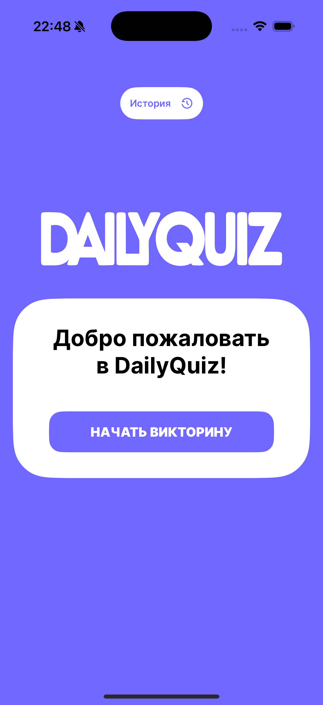
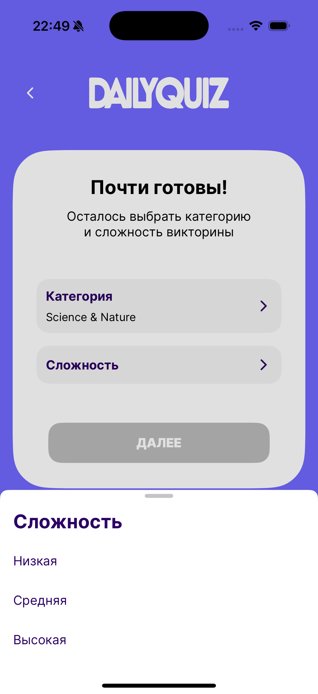
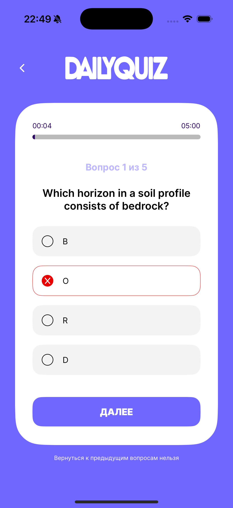
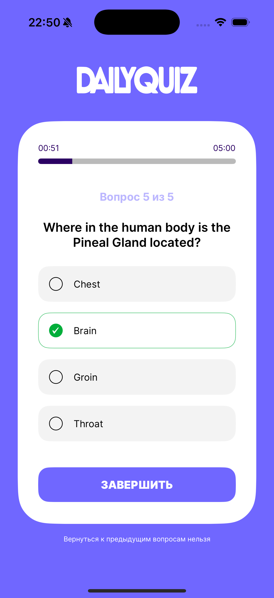
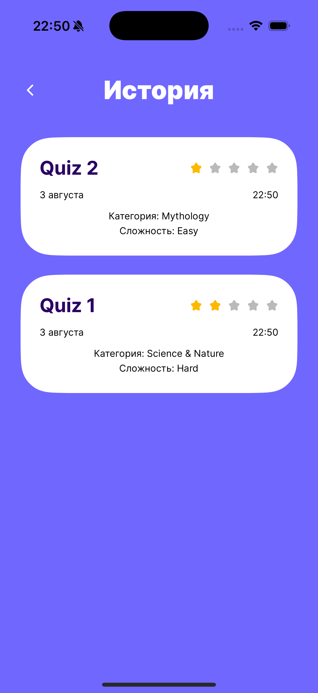
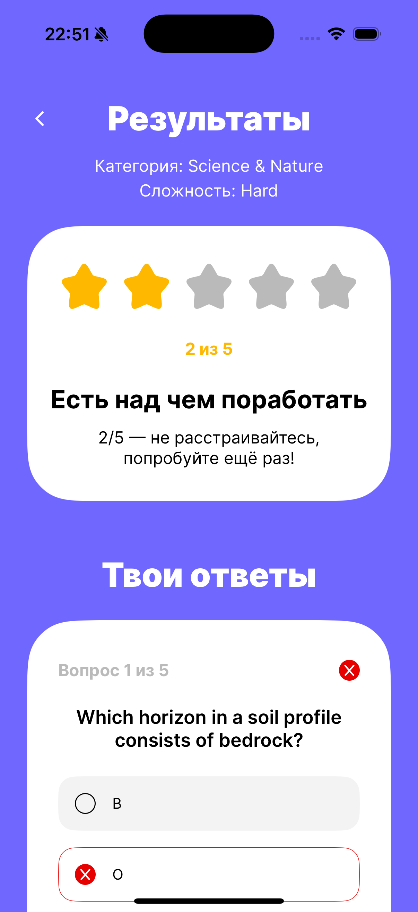
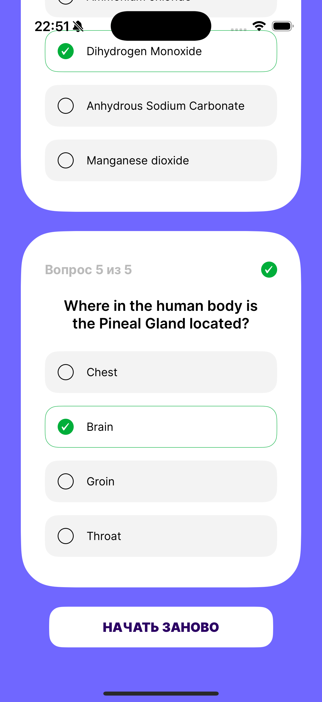

# DailyQuiz

## О проекте
Проект выполнен в рамках летней школы Surf 2025.
DailyQuiz приложение по прохождению викторин на выбранные темы с возможностью просмотра истории.

## Стек
**UI:** SwiftUI
**Архитектура:** MVVM
**Работа с сетью:** URLSession
- NetworkService для отправки запроса в сеть. TriviaApiService использует NetworkService для получения списка вопросов.
**Работа с памятью:** Core Data
- CoreDataManager - Singleton-класс отвечает за работу с Core Data.
- Сохраняет историю викторины saveQuizResult().
- Получает данные fetchQuizHistory(), fetchQuestions().
**Многопоточность:** async/await
**Навигация:** NavigationStack + navigationDestination with routes
- NavigationManager + AppRouteEnum отвечают за навигацию между экранами
- Главный экран меняет контент через ContentStateEnum
**Добавлена иконка приложения**

**Выполнены все основные и дополнительные задания согласно ТЗ**

### Скриншоты

  
  
  
   
  
  
   
  
  

